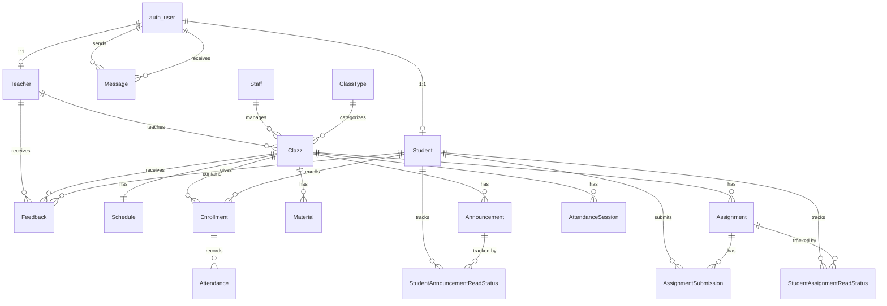

# Database Schema Documentation
## ClassManagementWebsite

This document describes all database tables and their relationships in the ClassManagementWebsite project.

---

## ER Diagram

---

## Table Descriptions

### 1. auth_user (Django Built-in)

Django's default user authentication table. Used for login credentials.

| Column | Type | Constraints | Description |
|--------|------|-------------|-------------|
| id | INT | PK, AUTO_INCREMENT | User ID |
| username | VARCHAR(150) | UNIQUE, NOT NULL | Login username |
| password | VARCHAR(128) | NOT NULL | Hashed password |
| first_name | VARCHAR(150) | | First name |
| last_name | VARCHAR(150) | | Last name |
| email | VARCHAR(254) | | Email address |
| is_staff | BOOLEAN | DEFAULT FALSE | Django admin access |
| is_active | BOOLEAN | DEFAULT TRUE | Account active status |
| is_superuser | BOOLEAN | DEFAULT FALSE | Superuser status |
| date_joined | DATETIME | NOT NULL | Registration date |

---

### 2. core_teacher

Stores teacher profile information.

| Column | Type | Constraints | Description |
|--------|------|-------------|-------------|
| teacher_id | INT | PK, AUTO_INCREMENT | Teacher ID |
| user_id | INT | FK → auth_user.id, UNIQUE, NULL | Linked user account |
| full_name | VARCHAR(100) | NOT NULL | Full name |
| dob | DATE | NOT NULL | Date of birth |
| phone_number | VARCHAR(15) | NOT NULL | Phone number |
| email | VARCHAR(254) | NOT NULL | Email address |
| address | VARCHAR(255) | NOT NULL | Street address |
| qualification | VARCHAR(100) | NOT NULL | Academic qualification |
| created_at | DATETIME | AUTO | Record creation time |
| updated_at | DATETIME | AUTO | Last update time |

**Relationships:**
- One-to-One with `auth_user` (optional)
- One-to-Many with `core_clazz` (teaches classes)
- One-to-Many with `core_feedback` (receives feedback)

---

### 3. core_student

Stores student profile information.

| Column | Type | Constraints | Description |
|--------|------|-------------|-------------|
| student_id | INT | PK, AUTO_INCREMENT | Student ID |
| user_id | INT | FK → auth_user.id, UNIQUE, NULL | Linked user account |
| full_name | VARCHAR(100) | NOT NULL | Full name |
| dob | DATE | NOT NULL | Date of birth |
| phone_number | VARCHAR(15) | NOT NULL | Phone number |
| email | VARCHAR(254) | NOT NULL | Email address |
| address | VARCHAR(255) | NOT NULL | Street address |
| created_at | DATETIME | AUTO | Record creation time |
| updated_at | DATETIME | AUTO | Last update time |

**Relationships:**
- One-to-One with `auth_user` (optional)
- One-to-Many with `core_enrollment` (enrolled in classes)
- One-to-Many with `core_feedback` (gives feedback)
- One-to-Many with `core_assignmentsubmission` (submits assignments)
- One-to-Many with `core_studentannouncementreadstatus` (tracks read announcements)
- One-to-Many with `core_studentassignmentreadstatus` (tracks read assignments)

---

### 4. core_staff

Stores administrative staff information.

| Column | Type | Constraints | Description |
|--------|------|-------------|-------------|
| staff_id | INT | PK, AUTO_INCREMENT | Staff ID |
| full_name | VARCHAR(100) | NOT NULL | Full name |
| dob | DATE | NOT NULL | Date of birth |
| phone_number | VARCHAR(15) | NOT NULL | Phone number |
| email | VARCHAR(254) | NOT NULL | Email address |
| address | VARCHAR(255) | NOT NULL | Street address |
| position | VARCHAR(100) | NOT NULL | Job position |
| created_at | DATETIME | AUTO | Record creation time |
| updated_at | DATETIME | AUTO | Last update time |

**Relationships:**
- One-to-Many with `core_clazz` (manages classes)

---

### 5. core_classtype

Defines different types/categories of classes.

| Column | Type | Constraints | Description |
|--------|------|-------------|-------------|
| type_id | INT | PK, AUTO_INCREMENT | Type ID |
| code | VARCHAR(10) | UNIQUE, NOT NULL | Type code (e.g., MATH, ENG) |
| description | TEXT | NOT NULL | Type description |
| created_at | DATETIME | AUTO | Record creation time |
| updated_at | DATETIME | AUTO | Last update time |

**Relationships:**
- One-to-Many with `core_clazz` (categorizes classes)

---

### 6. core_clazz

Stores class/course information.

| Column | Type | Constraints | Description |
|--------|------|-------------|-------------|
| class_id | INT | PK, AUTO_INCREMENT | Class ID |
| class_name | VARCHAR(100) | NOT NULL | Class name |
| class_type_id | INT | FK → core_classtype.type_id | Class category |
| teacher_id | INT | FK → core_teacher.teacher_id, NULL | Assigned teacher |
| staff_id | INT | FK → core_staff.staff_id, NULL | Assigned staff |
| start_date | DATE | NOT NULL | Class start date |
| end_date | DATE | NOT NULL | Class end date |
| price | DECIMAL(10,2) | NOT NULL | Class fee |
| room | VARCHAR(50) | NOT NULL | Room location |
| image | VARCHAR(255) | DEFAULT 'class_images/default_class.png' | Class image |
| created_at | DATETIME | AUTO | Record creation time |
| updated_at | DATETIME | AUTO | Last update time |

**Relationships:**
- Many-to-One with `core_classtype`
- Many-to-One with `core_teacher` (assigned teacher)
- Many-to-One with `core_staff` (assigned staff)
- One-to-One with `core_schedule`
- One-to-Many with `core_enrollment`
- One-to-Many with `core_material`
- One-to-Many with `core_announcement`
- One-to-Many with `core_assignment`
- One-to-Many with `core_attendancesession`
- One-to-Many with `core_feedback`

---

### 7. core_enrollment

Tracks student enrollment in classes with grades.

| Column | Type | Constraints | Description |
|--------|------|-------------|-------------|
| enrollment_id | INT | PK, AUTO_INCREMENT | Enrollment ID |
| student_id | INT | FK → core_student.student_id | Enrolled student |
| clazz_id | INT | FK → core_clazz.class_id | Target class |
| enrollment_date | DATE | DEFAULT NOW | Enrollment date |
| status | VARCHAR(20) | DEFAULT 'pending' | Status: pending/approved/rejected |
| is_paid | BOOLEAN | DEFAULT FALSE | Payment status |
| minitest1 | FLOAT | NULL | Mini Test 1 score |
| minitest2 | FLOAT | NULL | Mini Test 2 score |
| minitest3 | FLOAT | NULL | Mini Test 3 score |
| minitest4 | FLOAT | NULL | Mini Test 4 score |
| midterm | FLOAT | NULL | Midterm exam score |
| final_test | FLOAT | NULL | Final test score |
| created_at | DATETIME | AUTO | Record creation time |
| updated_at | DATETIME | AUTO | Last update time |

**Constraints:**
- UNIQUE (`student_id`, `clazz_id`) - A student can only enroll once per class

**Relationships:**
- Many-to-One with `core_student`
- Many-to-One with `core_clazz`
- One-to-Many with `core_attendance`

---

### 8. core_schedule

Stores class schedule information.

| Column | Type | Constraints | Description |
|--------|------|-------------|-------------|
| schedule_id | INT | PK, AUTO_INCREMENT | Schedule ID |
| clazz_id | INT | FK → core_clazz.class_id, UNIQUE | Associated class |
| day_of_week | VARCHAR(50) | NOT NULL | Class days (e.g., "Monday, Wednesday") |
| start_time | TIME | NOT NULL | Class start time |
| end_time | TIME | NOT NULL | Class end time |
| created_at | DATETIME | AUTO | Record creation time |
| updated_at | DATETIME | AUTO | Last update time |

**Relationships:**
- One-to-One with `core_clazz`

---

### 9. core_attendance

Tracks daily attendance records for enrolled students.

| Column | Type | Constraints | Description |
|--------|------|-------------|-------------|
| attendance_id | INT | PK, AUTO_INCREMENT | Attendance ID |
| enrollment_id | INT | FK → core_enrollment.enrollment_id | Student enrollment |
| date | DATE | NOT NULL | Attendance date |
| status | VARCHAR(20) | NOT NULL | Status: Present/Absent/Excused |
| created_at | DATETIME | AUTO | Record creation time |
| updated_at | DATETIME | AUTO | Last update time |

**Relationships:**
- Many-to-One with `core_enrollment`

---

### 10. core_attendancesession

Manages QR code-based attendance sessions.

| Column | Type | Constraints | Description |
|--------|------|-------------|-------------|
| session_id | INT | PK, AUTO_INCREMENT | Session ID |
| clazz_id | INT | FK → core_clazz.class_id | Associated class |
| date | DATE | DEFAULT NOW | Session date |
| token | VARCHAR(64) | UNIQUE, NOT NULL | Unique session token for QR |
| passcode | VARCHAR(4) | DEFAULT '0000' | 4-digit verification code |
| is_active | BOOLEAN | DEFAULT TRUE | Session active status |
| created_at | DATETIME | AUTO | Record creation time |

**Relationships:**
- Many-to-One with `core_clazz`

---

### 11. core_feedback

Stores student feedback for teachers and classes.

| Column | Type | Constraints | Description |
|--------|------|-------------|-------------|
| feedback_id | INT | PK, AUTO_INCREMENT | Feedback ID |
| student_id | INT | FK → core_student.student_id | Feedback author |
| teacher_id | INT | FK → core_teacher.teacher_id | Rated teacher |
| clazz_id | INT | FK → core_clazz.class_id | Rated class |
| teacher_rate | DECIMAL(3,2) | NOT NULL | Teacher rating (1-10) |
| class_rate | DECIMAL(3,2) | NOT NULL | Class rating (1-10) |
| comment | TEXT | BLANK | Optional comment |
| created_at | DATETIME | AUTO | Record creation time |
| updated_at | DATETIME | AUTO | Last update time |

**Relationships:**
- Many-to-One with `core_student`
- Many-to-One with `core_teacher`
- Many-to-One with `core_clazz`

---

### 12. core_message

Internal messaging system between users.

| Column | Type | Constraints | Description |
|--------|------|-------------|-------------|
| id | INT | PK, AUTO_INCREMENT | Message ID |
| sender_id | INT | FK → auth_user.id | Message sender |
| recipient_id | INT | FK → auth_user.id | Message recipient |
| subject | VARCHAR(255) | NOT NULL | Message subject |
| body | TEXT | NOT NULL | Message content |
| is_read | BOOLEAN | DEFAULT FALSE | Read status |
| created_at | DATETIME | AUTO | Sent timestamp |

**Relationships:**
- Many-to-One with `auth_user` (sender)
- Many-to-One with `auth_user` (recipient)

---

### 13. core_material

Stores class learning materials.

| Column | Type | Constraints | Description |
|--------|------|-------------|-------------|
| id | INT | PK, AUTO_INCREMENT | Material ID |
| title | VARCHAR(255) | NOT NULL | Material title |
| file | VARCHAR(255) | NOT NULL | File path |
| clazz_id | INT | FK → core_clazz.class_id | Associated class |
| uploaded_at | DATETIME | AUTO | Upload timestamp |

**Relationships:**
- Many-to-One with `core_clazz`

---

### 14. core_announcement

Stores class announcements.

| Column | Type | Constraints | Description |
|--------|------|-------------|-------------|
| id | INT | PK, AUTO_INCREMENT | Announcement ID |
| title | VARCHAR(255) | NOT NULL | Announcement title |
| content | TEXT | NOT NULL | Announcement content |
| clazz_id | INT | FK → core_clazz.class_id | Associated class |
| posted_at | DATETIME | AUTO | Posted timestamp |

**Relationships:**
- Many-to-One with `core_clazz`
- One-to-Many with `core_studentannouncementreadstatus`

---

### 15. core_assignment

Stores class assignments.

| Column | Type | Constraints | Description |
|--------|------|-------------|-------------|
| id | INT | PK, AUTO_INCREMENT | Assignment ID |
| title | VARCHAR(255) | NOT NULL | Assignment title |
| description | TEXT | NOT NULL | Assignment description |
| due_date | DATETIME | NOT NULL | Submission deadline |
| clazz_id | INT | FK → core_clazz.class_id | Associated class |
| created_at | DATETIME | AUTO | Creation timestamp |

**Relationships:**
- Many-to-One with `core_clazz`
- One-to-Many with `core_assignmentsubmission`
- One-to-Many with `core_studentassignmentreadstatus`

---

### 16. core_assignmentsubmission

Tracks student assignment submissions.

| Column | Type | Constraints | Description |
|--------|------|-------------|-------------|
| id | INT | PK, AUTO_INCREMENT | Submission ID |
| assignment_id | INT | FK → core_assignment.id | Target assignment |
| student_id | INT | FK → core_student.student_id | Submitting student |
| submission_file | VARCHAR(255) | NOT NULL | Submitted file path |
| submitted_at | DATETIME | AUTO | Submission timestamp |
| grade | FLOAT | NULL | Assigned grade |
| feedback | TEXT | BLANK | Teacher feedback |

**Constraints:**
- UNIQUE (`assignment_id`, `student_id`) - One submission per student per assignment

**Relationships:**
- Many-to-One with `core_assignment`
- Many-to-One with `core_student`

---

### 17. core_studentannouncementreadstatus

Tracks which announcements students have read.

| Column | Type | Constraints | Description |
|--------|------|-------------|-------------|
| id | INT | PK, AUTO_INCREMENT | Status ID |
| student_id | INT | FK → core_student.student_id | Student |
| announcement_id | INT | FK → core_announcement.id | Announcement |
| is_read | BOOLEAN | DEFAULT FALSE | Read status |
| read_at | DATETIME | NULL | Read timestamp |

**Constraints:**
- UNIQUE (`student_id`, `announcement_id`)

**Relationships:**
- Many-to-One with `core_student`
- Many-to-One with `core_announcement`

---

### 18. core_studentassignmentreadstatus

Tracks which assignments students have viewed.

| Column | Type | Constraints | Description |
|--------|------|-------------|-------------|
| id | INT | PK, AUTO_INCREMENT | Status ID |
| student_id | INT | FK → core_student.student_id | Student |
| assignment_id | INT | FK → core_assignment.id | Assignment |
| is_read | BOOLEAN | DEFAULT FALSE | Read status |
| read_at | DATETIME | NULL | Read timestamp |

**Constraints:**
- UNIQUE (`student_id`, `assignment_id`)

**Relationships:**
- Many-to-One with `core_student`
- Many-to-One with `core_assignment`

---

## Relationship Summary

| Relationship Type | Tables | Description |
|-------------------|--------|-------------|
| One-to-One | `auth_user` ↔ `Teacher` | User account links to teacher profile |
| One-to-One | `auth_user` ↔ `Student` | User account links to student profile |
| One-to-One | `Clazz` ↔ `Schedule` | Each class has exactly one schedule |
| One-to-Many | `ClassType` → `Clazz` | A type categorizes many classes |
| One-to-Many | `Teacher` → `Clazz` | A teacher teaches many classes |
| One-to-Many | `Staff` → `Clazz` | A staff manages many classes |
| One-to-Many | `Clazz` → `Enrollment` | A class has many enrollments |
| One-to-Many | `Student` → `Enrollment` | A student has many enrollments |
| One-to-Many | `Enrollment` → `Attendance` | An enrollment has many attendance records |
| One-to-Many | `Clazz` → `AttendanceSession` | A class has many QR sessions |
| One-to-Many | `Clazz` → `Material` | A class has many materials |
| One-to-Many | `Clazz` → `Announcement` | A class has many announcements |
| One-to-Many | `Clazz` → `Assignment` | A class has many assignments |
| One-to-Many | `Assignment` → `AssignmentSubmission` | An assignment has many submissions |
| One-to-Many | `Student` → `AssignmentSubmission` | A student makes many submissions |
| One-to-Many | `Clazz` → `Feedback` | A class receives many feedbacks |
| One-to-Many | `Teacher` → `Feedback` | A teacher receives many feedbacks |
| One-to-Many | `Student` → `Feedback` | A student gives many feedbacks |
| One-to-Many | `auth_user` → `Message` | A user sends many messages |
| One-to-Many | `auth_user` → `Message` | A user receives many messages |
| Many-to-Many | `Student` ↔ `Clazz` | Through `Enrollment` junction table |
| Many-to-Many | `Student` ↔ `Announcement` | Through `StudentAnnouncementReadStatus` |
| Many-to-Many | `Student` ↔ `Assignment` | Through `StudentAssignmentReadStatus` |

---

## Table Count Summary

| Table | Purpose |
|-------|---------|
| 1. `auth_user` | User authentication |
| 2. `core_teacher` | Teacher profiles |
| 3. `core_student` | Student profiles |
| 4. `core_staff` | Staff profiles |
| 5. `core_classtype` | Class categories |
| 6. `core_clazz` | Classes/Courses |
| 7. `core_enrollment` | Student-Class enrollment |
| 8. `core_schedule` | Class schedules |
| 9. `core_attendance` | Daily attendance |
| 10. `core_attendancesession` | QR attendance sessions |
| 11. `core_feedback` | Student feedback |
| 12. `core_message` | Internal messaging |
| 13. `core_material` | Class materials |
| 14. `core_announcement` | Class announcements |
| 15. `core_assignment` | Class assignments |
| 16. `core_assignmentsubmission` | Assignment submissions |
| 17. `core_studentannouncementreadstatus` | Announcement read tracking |
| 18. `core_studentassignmentreadstatus` | Assignment read tracking |

**Total: 18 tables** (17 custom + 1 Django built-in auth_user)
